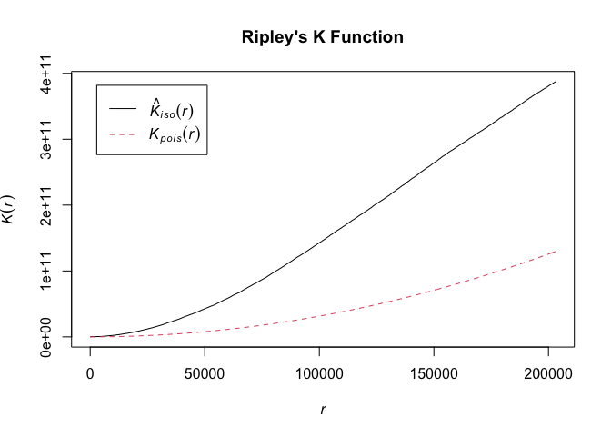

GIS Midterm
================
Victoria Mello
2023-10-16

``` r
# Load the necessary libraries
library(sf)
```

    ## Linking to GEOS 3.11.0, GDAL 3.5.3, PROJ 9.1.0; sf_use_s2() is TRUE

``` r
library(tidyverse)
```

    ## ── Attaching core tidyverse packages ──────────────────────── tidyverse 2.0.0 ──
    ## ✔ dplyr     1.1.3     ✔ readr     2.1.4
    ## ✔ forcats   1.0.0     ✔ stringr   1.5.0
    ## ✔ ggplot2   3.4.3     ✔ tibble    3.2.1
    ## ✔ lubridate 1.9.2     ✔ tidyr     1.3.0
    ## ✔ purrr     1.0.2

    ## ── Conflicts ────────────────────────────────────────── tidyverse_conflicts() ──
    ## ✖ dplyr::filter() masks stats::filter()
    ## ✖ dplyr::lag()    masks stats::lag()
    ## ℹ Use the conflicted package (<http://conflicted.r-lib.org/>) to force all conflicts to become errors

``` r
library(spatstat)
```

    ## Loading required package: spatstat.data
    ## Loading required package: spatstat.geom
    ## spatstat.geom 3.2-5
    ## Loading required package: spatstat.random
    ## spatstat.random 3.1-6
    ## Loading required package: spatstat.explore
    ## Loading required package: nlme
    ## 
    ## Attaching package: 'nlme'
    ## 
    ## The following object is masked from 'package:dplyr':
    ## 
    ##     collapse
    ## 
    ## spatstat.explore 3.2-3
    ## Loading required package: spatstat.model
    ## Loading required package: rpart
    ## spatstat.model 3.2-6
    ## Loading required package: spatstat.linnet
    ## spatstat.linnet 3.1-1
    ## 
    ## spatstat 3.0-6 
    ## For an introduction to spatstat, type 'beginner'

``` r
# Read in fracking wells 
  frack <- st_read("data/fracking_wells.shp")
```

    ## Reading layer `fracking_wells' from data source 
    ##   `/Users/vickymello/Documents/GIS Labs/Midterm/GISmidterm/data/fracking_wells.shp' 
    ##   using driver `ESRI Shapefile'
    ## Simple feature collection with 23379 features and 3 fields
    ## Geometry type: POINT
    ## Dimension:     XY
    ## Bounding box:  xmin: 1192346 ymin: -156719 xmax: 2665003 ymax: 674138
    ## Projected CRS: NAD83(NSRS2007) / Pennsylvania North (ftUS)

``` r
# Make random selection
 frack %>% 
   sample_n(500) -> frack_500
```

Calculate Ripleys K:

``` r
frack_ppp <- as.ppp(frack_500)  # Convert the sample to a ppp object
```

    ## Warning in as.ppp.sf(frack_500): only first attribute column is used for marks

``` r
k_result <- Kest(frack_ppp, correction = "Ripley")

plot(k_result, main = "Ripley's K Function")
```

<!-- -->

``` r
summary(k_result)
```

    ##        r               theo                iso           
    ##  Min.   :     0   Min.   :0.000e+00   Min.   :1.769e+07  
    ##  1st Qu.: 50792   1st Qu.:8.105e+09   1st Qu.:4.381e+10  
    ##  Median :101585   Median :3.242e+10   Median :1.464e+11  
    ##  Mean   :101585   Mean   :4.327e+10   Mean   :1.610e+11  
    ##  3rd Qu.:152377   3rd Qu.:7.294e+10   3rd Qu.:2.701e+11  
    ##  Max.   :203170   Max.   :1.297e+11   Max.   :3.873e+11
